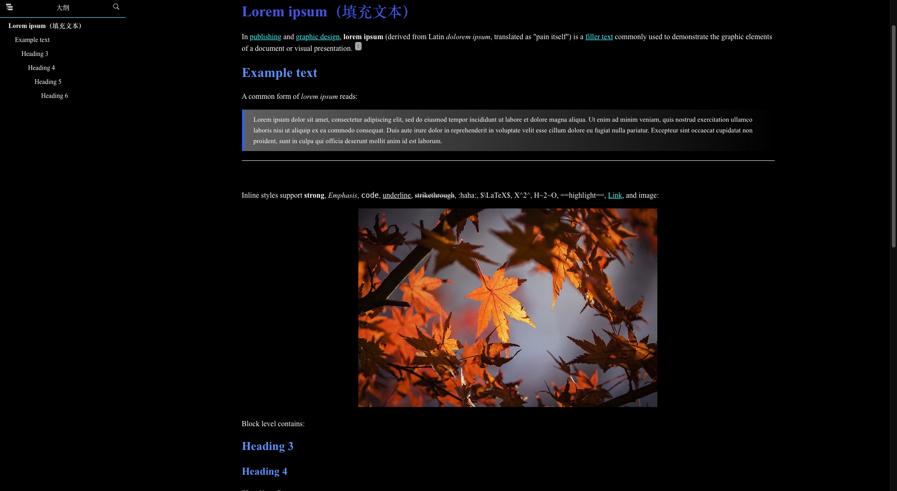
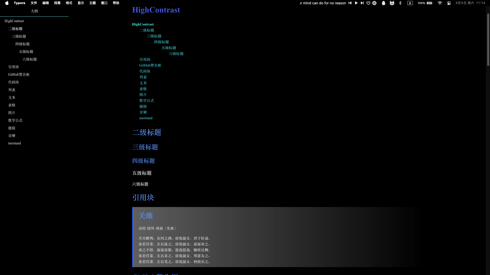
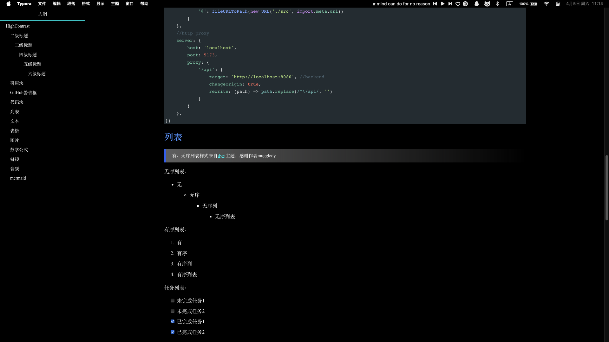

<h1 align='center'>High-Contrast Theme For Typora</h1>

<p align="center">
    <a href="https://github.com/Zervan29131/high-contrast/blob/main/Readme.md
    ">简体中文</a>
    |
    English
</p>
<p align="center">
  
  
  
  
  
  
</p>


## **1. Overview**




<details><summary><kbd>展开查看更多截图</summary></kbd>
  </br>
  </br>
  </br>
  </br>
  </br>
</details>

---

## 2. How to Use

### 2.1 Download Files

> 1. Download the [theme file package](https://github.com/Zervan29131/high-contrast/releases)
> 2. In Typora, select File → Preferences → Appearance → Open Theme Folder
> 3. Extract the downloaded package, paste the **CSS files** and **folders** into Typora's theme folder (themes)
> 4. Restart Typora and switch the theme in the menu bar, and you're done
>
> The advantage of this method is that you download fewer files, containing only the necessary theme files. The disadvantage is that it's more complicated, and if you want to update later, you'll need to download and replace the files again.

### 2.2 Clone

> [!caution]
>
> 1. Find Typora's theme folder (themes) as mentioned above, and open a terminal in this folder
>
> 2. **To avoid cloning irrelevant files from other branches, please make sure to use the command below!! Otherwise, you'll have to download for a long time** (The project is forked from the official repository, and the commit history includes records from the gh-pages branch)
>
>    ```shell
>    git clone --single-branch https://github.com/Zervan29131/high-contrast.git
>    ```
>
> The advantage of this method is that it's more convenient. For future updates, you only need to use the `git pull` command to get the latest commits. The disadvantage is that cloning will download all the project files, including some unnecessary md files, etc.

---

## 3. About Customization

If you want to add your own styles, it's not recommended to modify the `high-contrast.css` file directly.

You can create a new `high-contrast.user.css` file in the same directory as `high-contrast.css`, and put your styles in this file. It has higher priority, and when you update later, you only need to update `high-contrast.css` without overriding your styles.

If `high-contrast.user.css` doesn't work, you may need to add `!important` to increase priority.

## 4. Acknowledgements

⭐ If you like the theme, please give it a star, thank you 🙏!

❓ If you have any questions, you can ask in [Issues](https://github.com/Zervan29131/high-contrast/issues), all opinions are welcome!

🎉 Thank you for your support, your support is my motivation to move forward!