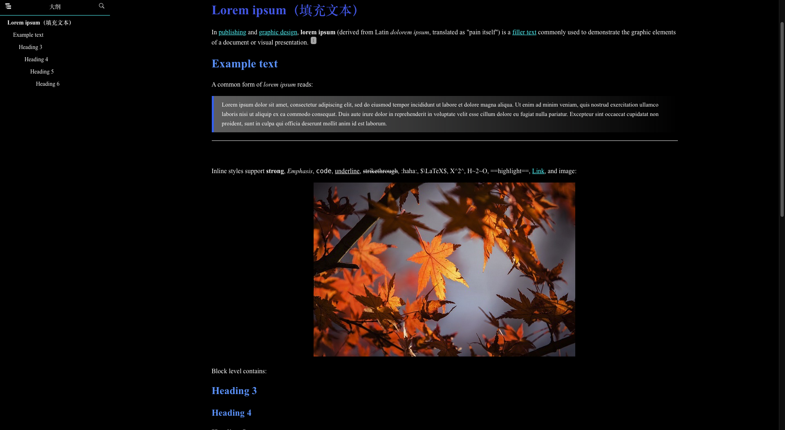
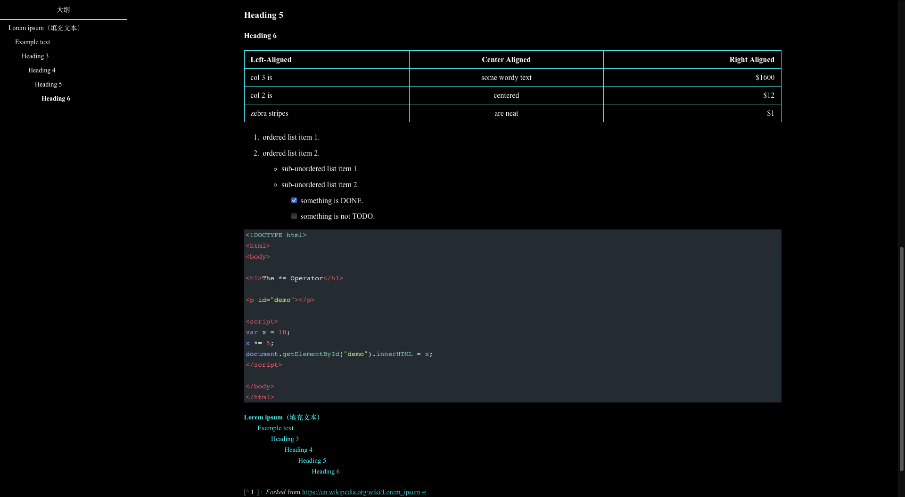
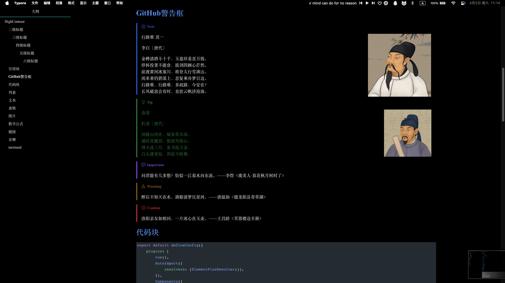
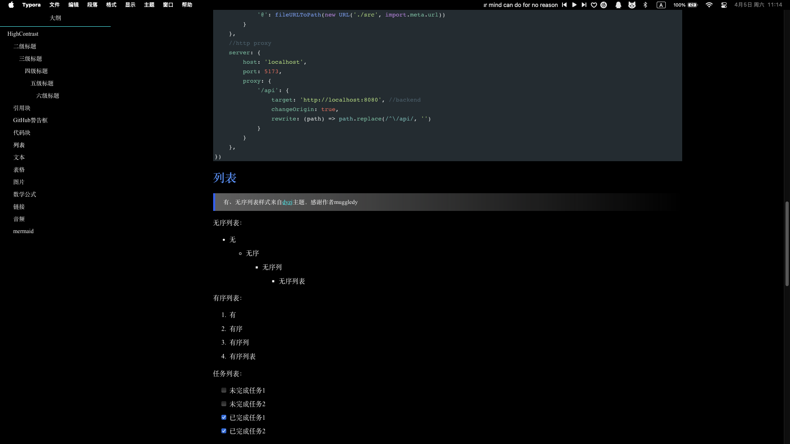
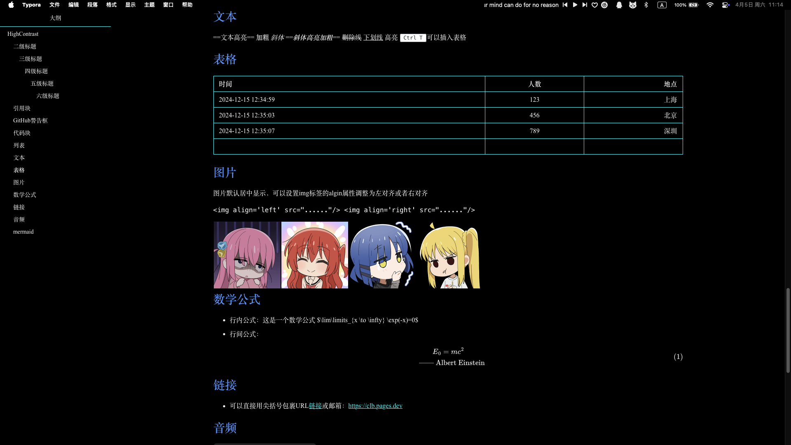
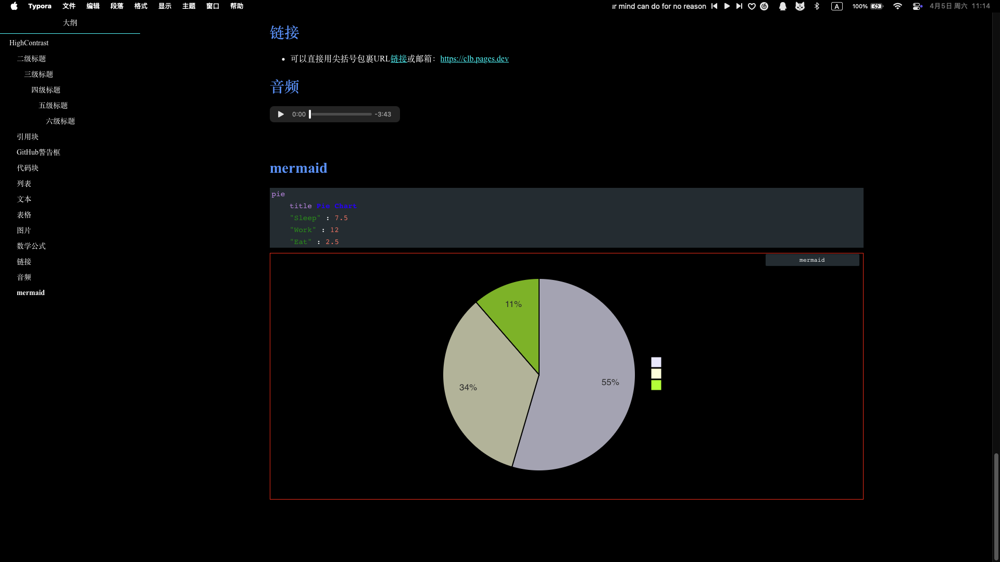

<h1 align='center'>High-Contrast Theme For Typora</h1>

<p align="center">
    简体中文
    |
    <a href="https://github.com/Zervan29131/high-contrast/blob/main/README_en.md
    ">English</a>
</p>

<p align="center">
  
  
  
  
  
  
</p>


## **1.概览**




<details><summary><kbd>展开查看更多截图</summary></kbd>
  </br>
  </br>
  </br>
  </br>
  </br>
</details>

---

## 2.如何使用

### 2.1 下载文件

> 1. 下载[主题文件压缩包](https://github.com/Zervan29131/high-contrast/releases)
> 2. 在typora中选择 文件 → 偏好设置 → 外观 → 打开主题文件夹
> 3. 将下载的压缩包解压，将**css文件**和**文件夹**粘贴到typora的主题文件夹themes中
> 4. 重启Typora然后在菜单栏切换主题，大功告成
>
> 这种方法的优点是下载的文件更少，只含有主题必须的文件，缺点是比较麻烦，如果后续想要更新需要重新下载进行替换

### 2.2 克隆

> [!caution]
>
> 1. 同上找到typora的主题文件夹themes，在这个文件夹下打开一个终端
>
> 2. **为了避免克隆到其他分支的无关文件，请一定要使用下面这条命令克隆！！否则你要下载很长时间**（项目fork自官方仓库，提交历史包含了gh-pages分支的记录）
>
>    ```shell
>    git clone --single-branch https://github.com/Zervan29131/high-contrast.git
>    ```
>
> 这种方法的优点是比较方便，后续更新只需要`git pull`命令即可获取最新的提交，缺点是clone会将整个项目的文件下载下来，包括一些不必要的md文件等

---

## 3.关于自定义

如果你想添加一些自己的样式，不建议你直接修改`high-contrast.css`文件。

你可以在`high-contrast.css`同级目录下新建一个`high-contrast.user.css`文件，将你的样式放在这个文件，它有更高的优先级，而且你后续要更新只需要更新`high-contrast.css`，不会覆盖你的样式

如果`high-contrast.user.css`无效，你可能要添加`!important`提高优先级


## 4.致谢

⭐ 如果喜欢主题的话，请给一个star吧，感谢🙏！

❓有任何问题都可以在 [Issues](https://github.com/Zervan29131/high-contrast/issues) 提问，欢迎各种意见！

🎉 感谢给予支持的朋友，您的支持是我前进的动力！
